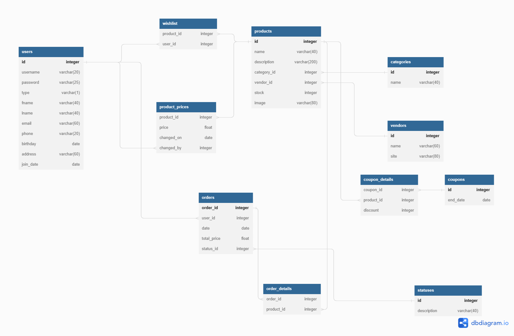

## פרויקט פיתוח אפליקציות אינטרנטיות

### חברי צוות

- דניאל נגורנוב 
- דניאל עדין 
- מקס ספקטור 
- דניאל פרץ 

### טכנולוגיות

- HTML 
- CSS 
- BOOTSTRAP 
- NODEJS 
- EXPRESS 
- JQUERY 
- MONGODB 

### פונקציונאליות האתר
<ins>בפרויקט כמה ישויות: </ins>

<ins>משתמשים:</ins> לקוח ואדמיניסטרטור ( עובד החנות).

<ins>אובייקטים:</ins> מוצר, ספק

 

כל משתמש חדש ( לקוח ) יכול להירשם ולהתחבר לאתר (יצירת משתמש חדש והתחברות).

בהרשמה - ולידאציות שונות ובהן: בדיקת תקינות סיסמא חזקה, בדיקת כתובת מול API וכו'. 

לשמור את הסיסמא בdb באמצעות HASH, בהתחברות יש לאשר captcha.

ללקוח אפשרות לעדכן את פרטיו (דף בפני עצמו).

לאדמין דף משלו לדוח לקוחות (יש לבדוק שאכן מחובר אדמין ולבדוק סשיון). בדף אדמין יוכל לסנן לקוחות לפי פרמטרים שונים, כמו חיפוש לפי שם פרטי ושם משפחה, חיפוש לפי אימייל, סינון לפי איזור מגורים, חיפוש לפי מספר פלאפון וכו'.  בעמוד זה אדמין יוכל לעדכן את פרטיו של לקוח או למחוק לקוחות. עבור כל לקוח יכול להיכנס לרשימת ההזמנות של אותו לקוח וכמובן לעדכן את ההזמנות \ ביטול ההזמנה וכו'. 

לאדמין אפשרות לעדכן את פרטיו של לקוח ולמחוק לגמרי לקוח. בעת מחיקת לקוח - יש רק לסמן בטבלה שהלקוח מחוק, לשם שמירת היסטוריה.

באתר - דף מוצרים בו לקוח יכול לחפש \ לסנן מוצרים ולהוסיף לסל הקניות. 

בדף נפרד לאדמין - תחזוקת מוצרים, הוספת מוצר חדש \ עדכון \ מחיקה של מוצרים. 

כמו כן, לאדמין יהיה גם דוחות סטטיסטיקה - דוחות לדוגמא של כמה מוצרים נמכרו החודש, כמה מכירות לכל ספק וכו'. 

עבור כל מוצר - מלאי משלו, לקוח לא יכול לקנות \ להזמין מוצר שחסר במלאי. 

ברגע שמוצר נהיה חסר במלאי - שליחת מייל לאדמין שהמוצר אזל במלאי. 

בעת הוספת מבצעים באתר - פרסום פוסט בפייסבוק על פרטי המבצע. 

ללקוח - דף עם רשימת ההזמנות שלו. 

לאדמין - דף עם רשימת כל ההזמנות עם סינונים \ חיפוש. אפשרות לשנות \ לדחות הזמנה. 

### מבנה הDB

